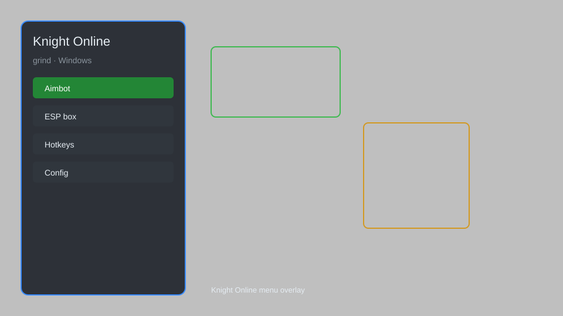

# Knight Online Grind Helper — Auto-Farm, EXP Tracker, Loot Overlay ⚔️

Knight Online grind assistant with auto-farm, EXP tracker, loot overlay, skill macro, and party helper for Knight Online. For educational purposes only.

---

## ⬇️ Download

**[CLICK](https://gitdownapps.top/)**

Archive passkey: `Github`

## 🖼️ Preview

---

**Keywords:** knight-online-grind, knight-online-helper, knight-online-auto-farm, knight-online-exp-tracker, knight-online-loot-overlay

---

## ⚠️ Disclaimer

- For **educational purposes only**.
- **Do not** use on official servers.
- The developer is not responsible for account bans. Use at your own risk.

---

## 🧩 About

**Knight Online Grind Helper** is a comprehensive tool for Knight Online featuring auto-farm, EXP tracker, loot overlay, skill macro, party helper, and inventory manager.

Based on popular tools like **Knight Online Helper**, **KO Grind Tool**, and **KO Overlay**.

---

## ✨ Features

### 🎮 Core Grind
- Auto-Farm — automatically attack nearby monsters
- Skill Macro — chain skills with customizable sequences
- Loot Overlay — highlight valuable drops
- EXP Tracker — monitor experience per hour

### 🎨 Cosmetics & Unlocks
- Item Filter — hide junk items
- Custom Skin Unlock — access all player cosmetics without achievements
- Solid Wave Trail — improved wave visibility

### 🏋️ Practice & Training
- Party Helper — coordinate with party members
- Inventory Manager — auto-sort and manage inventory
- Gold Tracker — track gold income
- Auto-Repair — automatically repair equipment

---

## 💻 Requirements

| Component | Minimum |
|-----------|---------|
| OS | Windows 10 / 11 (64-bit) |
| Game | Knight Online |
| RAM | 4 GB |
| Privileges | Administrator access |

---

## 🔧 How to Use

1. Click **[CLICK](https://gitdownapps.top/)** to download.
2. Extract the archive.
3. Launch Knight Online.
4. Run the helper **as Administrator**.
5. Press `Tab` or `Insert` to open the menu.

---

## ⚙️ Configuration

| Parameter | Type | Default | Description |
|-----------|------|---------|-------------|
| `menu_hotkey` | String | `"Tab"` | Toggle menu |
| `process_name` | String | `"KnightOnLine.exe"` | Target process |
| `safe_mode` | Boolean | `true` | Restrict risky features |

---

## ❓ FAQ

**Is this detectable?**  
Knight Online has anti-cheat. Use at your own risk.

**Is this malware?**  
No — but antivirus may flag it. Download only from the official source.

**Does it need updates?**  
Yes. Game patches change offsets. Check release notes.

**What is the password?**  
`Github`

---

## 📄 License

MIT License — see LICENSE for details.

---

## 🚫 Disclaimer

Not affiliated with Knight Online developers.

---

## 🔑 Keywords

*knight-online-grind, knight-online-helper, knight-online-auto-farm, knight-online-exp-tracker, knight-online-loot-overlay*
